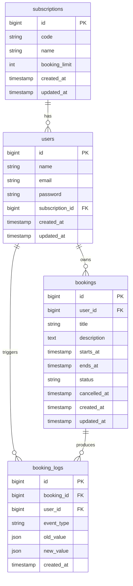

# ER Diagram

```mermaid
erDiagram
    subscriptions ||--o{ users : has
    users ||--o{ bookings : owns
    users ||--o{ booking_logs : triggers
    bookings ||--o{ booking_logs : produces

    subscriptions {
        bigint id PK
        string code
        string name
        int booking_limit
        timestamp created_at
        timestamp updated_at
    }

    users {
        bigint id PK
        string name
        string email
        string password
        bigint subscription_id FK
        timestamp created_at
        timestamp updated_at
    }

    bookings {
        bigint id PK
        bigint user_id FK
        string title
        text description
        timestamp starts_at
        timestamp ends_at
        string status
        timestamp cancelled_at
        timestamp created_at
        timestamp updated_at
    }

    booking_logs {
        bigint id PK
        bigint booking_id FK
        bigint user_id FK
        string event_type
        json old_value
        json new_value
        timestamp created_at
    }
```
